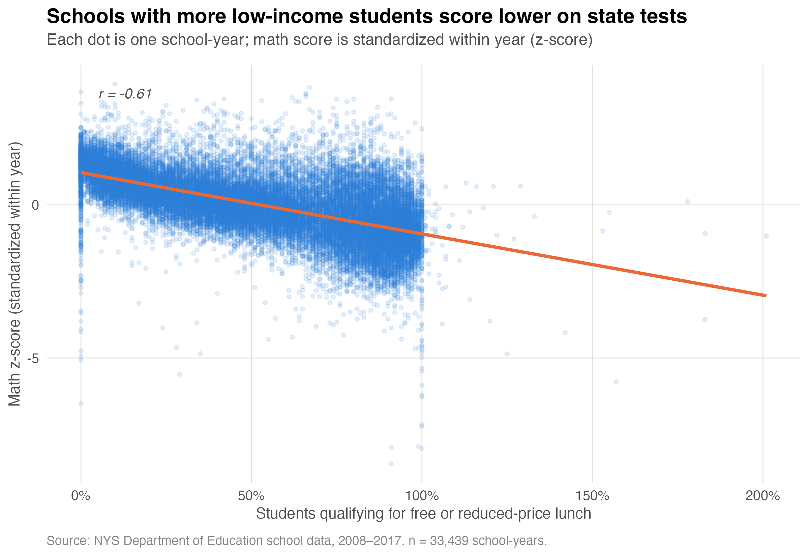
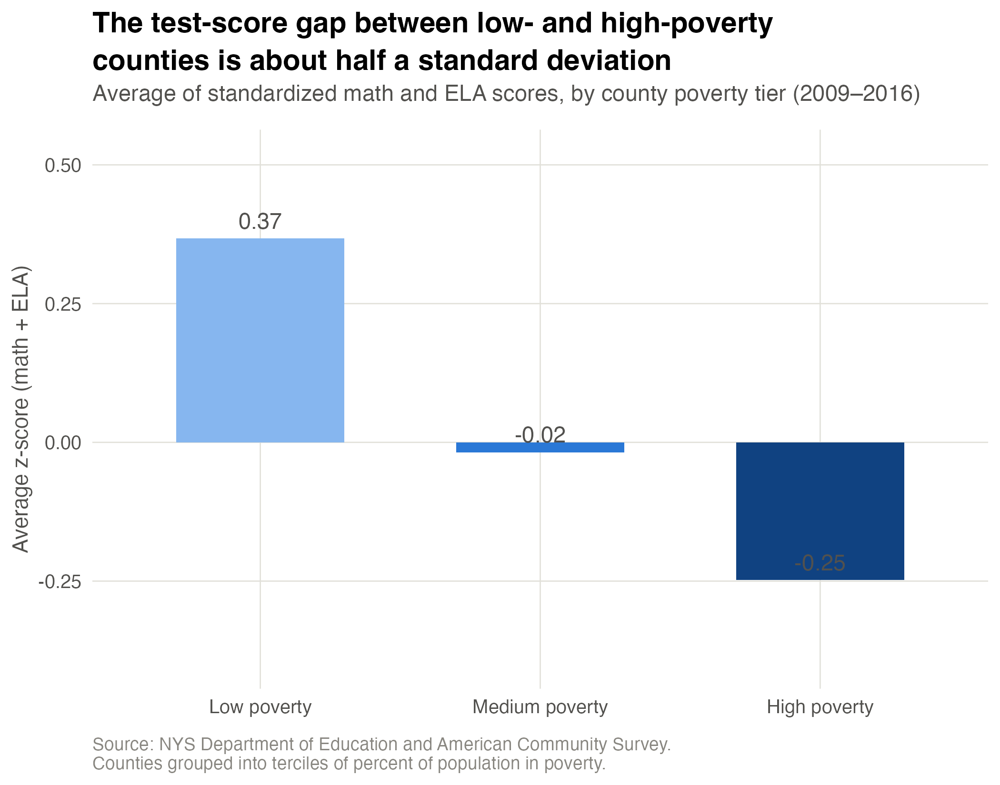
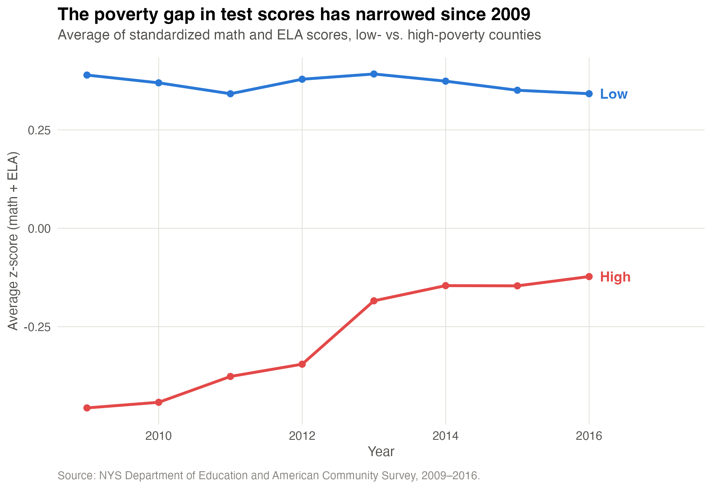

```{r setup, include=FALSE}
knitr::opts_chunk$set(echo = TRUE, message = FALSE, warning = FALSE, fig.align = "center")
library(tidyverse)
library(knitr)
```

## The question

The department asked: **what can data tell us about the relationship between
poverty and test performance in New York public schools?**, plus three
follow-ups: how big is the gap between low/medium/high poverty areas, has it
changed over time, and is it moderated by access to free/reduced-price lunch.

**Why this matters:** answers here shape where the department targets
resources (funding, staffing, program design) and whether current
interventions are narrowing or widening outcome gaps. Getting the poverty
measure and the score comparison wrong could send resources to the wrong
places or hide/mask a trend that's already improving.

**Before touching the data**, the plan was to (1) build one county-poverty
measure and split it into interpretable tiers, (2) make test scores
comparable across years despite NYS changing the underlying tests, (3)
compare scores across poverty tiers overall, by year, and by school-level
lunch access. The expectation going in: a negative poverty-performance
relationship, similar in direction to well-documented national patterns, with
the open questions being *how large*, *whether it's moving*, and *whether
county poverty or school-level need does more of the work*.

## Data

Two raw sources, joined by `county_name` and `year`:

- `data/data_raw/nys_schools.csv` — school-level enrollment, free/reduced
  lunch %, and mean ELA/math scores, 2008–2017.
- `data/data_raw/nys_acs.csv` — county-level poverty rate, median household
  income, and % with a bachelor's degree, 2009–2016.

```{r read-data}
schools_raw <- read_csv("data/data_raw/nys_schools.csv", show_col_types = FALSE)
acs_raw <- read_csv("data/data_raw/nys_acs.csv", show_col_types = FALSE)
```

### Cleaning

Missing values are coded as `-99` in both numeric and character columns of
the school data (e.g. `mean_math_score`, but also `county_name` itself for a
handful of rows). We recode both types to `NA` with one generic sweep rather
than hardcoding column names:

```{r recode-missing}
recode_missing <- function(df) {
  df %>%
    mutate(across(where(is.character), ~ na_if(.x, "-99")),
           across(where(is.numeric), ~ na_if(.x, -99)))
}

schools_clean <- recode_missing(schools_raw)
acs_clean <- recode_missing(acs_raw)

nys <- schools_clean %>% left_join(acs_clean, by = c("county_name", "year"))
```

### Poverty tiers

We split county poverty rate (`county_per_poverty`) into **terciles** —
low / medium / high — computed across all county-year observations:

```{r poverty-groups}
poverty_cuts <- quantile(acs_clean$county_per_poverty, probs = c(1/3, 2/3), na.rm = TRUE)

nys <- nys %>%
  mutate(
    poverty_group = case_when(
      is.na(county_per_poverty) ~ NA_character_,
      county_per_poverty <= poverty_cuts[1] ~ "low",
      county_per_poverty <= poverty_cuts[2] ~ "medium",
      TRUE ~ "high"
    ),
    poverty_group = factor(poverty_group, levels = c("low", "medium", "high"))
  )
```

**Why terciles:** they split the counties into three roughly equal-sized
groups using the data's own distribution, rather than an arbitrary rate
threshold (e.g. "poverty > 20%") that has no particular basis for New York
specifically.

### Comparable scores across years

NYS changed the underlying tests over this period, so raw scale scores
aren't comparable year to year. We standardize math and ELA scores to
z-scores *within each year*:

```{r zscores}
nys <- nys %>%
  group_by(year) %>%
  mutate(z_math = as.numeric(scale(mean_math_score)),
         z_ela = as.numeric(scale(mean_ela_score))) %>%
  ungroup()
```

Note: ACS poverty data only covers 2009–2016, while school data runs
2008–2017, so `poverty_group` is `NA` for 2008 and 2017 school records —
those two years are excluded from any poverty-tier comparison below.

*(Full cleaning script: [`scripts/1_cleaned.R`](scripts/1_cleaned.R).)*

## Summary tables

*(Built in [`scripts/2_summary_tables.R`](scripts/2_summary_tables.R); loaded
here from the saved output for speed.)*

**County profile** — enrollment, lunch access, and poverty rate for every
county (highest-poverty first):

```{r table-county-profile}
read_csv("data/processed/tables/1_county_profile.csv", show_col_types = FALSE) %>%
  kable(digits = 3, col.names = c("County", "Avg. annual enrollment", "% free/reduced lunch", "% in poverty"))
```

**Top 5 / bottom 5 poverty counties** — raw and standardized scores side by side:

```{r table-top-bottom}
read_csv("data/processed/tables/2_top_bottom_poverty_counties.csv", show_col_types = FALSE) %>%
  kable(digits = 3, col.names = c("Group", "County", "% poverty", "% free/reduced lunch",
                                   "Mean ELA", "Mean math", "Mean ELA z", "Mean math z"))
```

**Performance by poverty tier:**

```{r table-by-poverty}
read_csv("data/processed/tables/3_performance_by_poverty_group.csv", show_col_types = FALSE) %>%
  kable(digits = 3, col.names = c("Poverty tier", "N school-years", "% free/reduced lunch",
                                   "Mean ELA", "Mean math", "Mean ELA z", "Mean math z"))
```

**Poverty gap by year** (low-poverty minus high-poverty z-score):

```{r table-gap-year}
read_csv("data/processed/tables/4b_poverty_gap_by_year.csv", show_col_types = FALSE) %>%
  kable(digits = 3)
```

**Moderation by lunch access** — poverty tier crossed with school-level
free/reduced lunch rate (split at the median):

```{r table-moderation}
read_csv("data/processed/tables/5_moderation_by_lunch_access.csv", show_col_types = FALSE) %>%
  filter(!is.na(lunch_tier)) %>%
  kable(digits = 3, col.names = c("Poverty tier", "School lunch-access tier", "N school-years", "Mean ELA z", "Mean math z"))
```

## Visualizations

*(Built in [`scripts/3_visualizations.R`](scripts/3_visualizations.R).)*

### School-level: lunch access vs. performance

```{r fig-lunch, echo=FALSE}

```

Every dot is one school in one year. Math z-score falls steadily as the
share of students qualifying for free/reduced lunch rises (r = −0.61) — a
strong, consistent relationship at the individual-school level, not just an
artifact of averaging across counties.

### Performance by county poverty tier

```{r fig-poverty-group, echo=FALSE}

```

Low-poverty counties average +0.37 SD above the state mean; high-poverty
counties average −0.25 SD below it — roughly a 0.6 SD gap. Medium-poverty
counties sit almost exactly at the state average.

### Has the gap changed over time?

```{r fig-time, echo=FALSE}

```

Low-poverty counties have held steady around +0.35 SD every year.
High-poverty counties climbed from about −0.46 SD in 2009 to about −0.12 SD
by 2016 — the gap narrowed by more than half, and the movement came entirely
from high-poverty counties improving, not from low-poverty counties falling.

## Answering the department's questions

**What does the data tell us about poverty and test performance, overall?**
There's a clear, sizeable negative relationship. At the school level, the
share of students on free/reduced lunch correlates at r = −0.61 with math
performance; at the county level, high-poverty counties trail low-poverty
counties by roughly 0.6 SD in combined math/ELA performance.

**What's the difference between low, medium, and high poverty areas?**
Low-poverty counties: +0.37 SD. Medium-poverty: −0.02 SD (essentially the
state average). High-poverty: −0.25 SD. The gap is driven more by the
high-poverty tier underperforming than by the low-poverty tier
overperforming — medium sits right at zero.

**Has this relationship changed over time (2009–2016)?**
Yes — it has narrowed. The low-poverty line is flat across the period; the
high-poverty line rose steadily, especially between 2012 and 2013. Whatever
changed (policy, funding, staffing, or the tests themselves), it shows up
specifically in high-poverty counties' scores, not in low-poverty counties.

**Is the relationship moderated by free/reduced lunch access?**
Yes, substantially. Within every poverty tier — including high-poverty
counties — schools with below-median free/reduced lunch rates score far
better (z ≈ +0.5) than schools with above-median rates in the *same* tier
(z ≈ −0.5). School-level lunch access predicts performance about as strongly
as county-level poverty does, which means county poverty alone is an
incomplete picture: two schools in the same high-poverty county can look very
different depending on their own student population.

## Caveats and recommendations

- **Coverage gap:** poverty tiers can't be assigned for 2008 or 2017 (ACS
  data starts in 2009 and ends in 2016), so those two years are excluded from
  every poverty comparison above.
- **Ecological vs. individual level:** county poverty is a place-level
  measure; the lunch-access finding suggests school-level (or student-level)
  need is doing real, independent work beyond county averages, and would be
  worth investigating directly if student-level data becomes available.
- **Recommendation:** target interventions using school-level lunch-access
  data rather than county poverty tier alone — the moderation result shows
  county tier alone would misclassify plenty of individual schools.
- **Recommendation:** investigate what changed for high-poverty counties
  around 2012–2013, since whatever it was appears to be working and could be
  a candidate to expand or protect.
