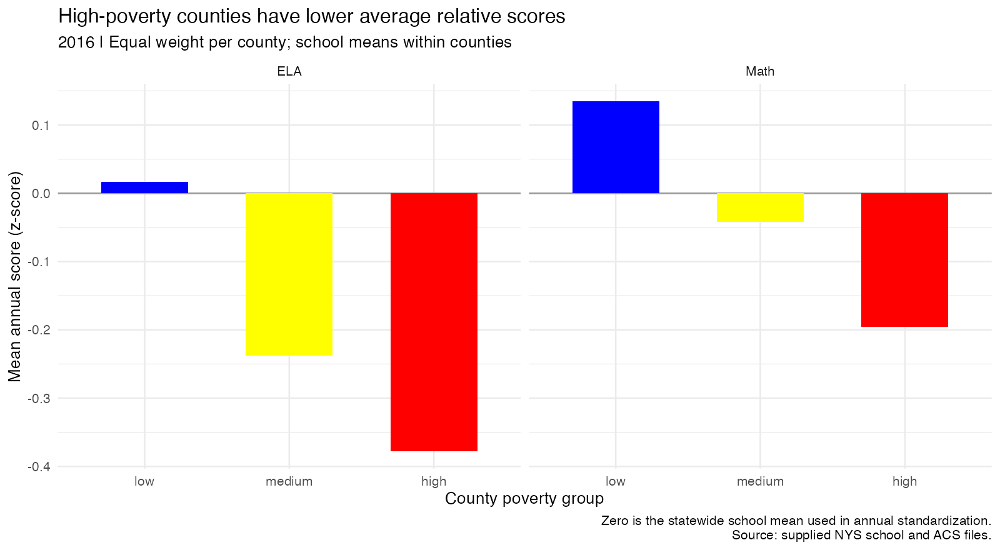
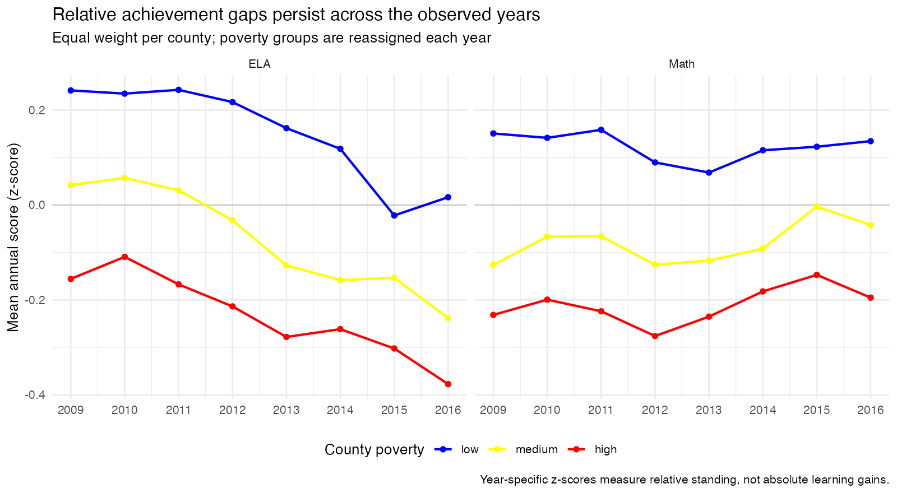
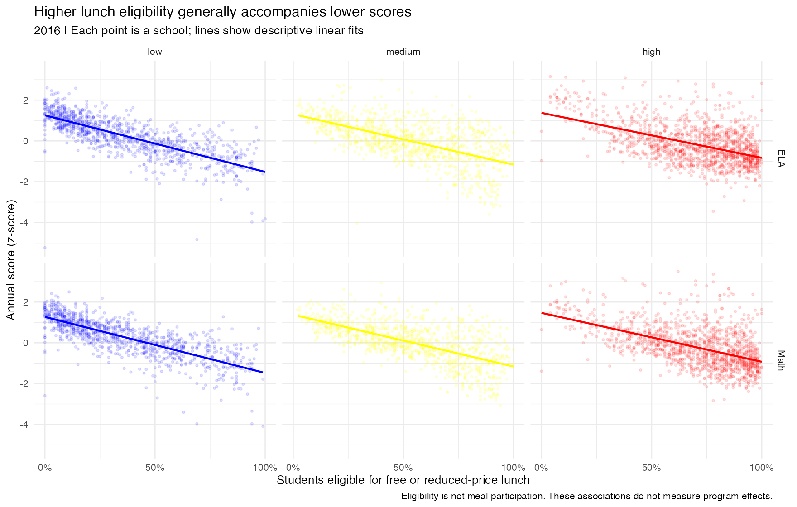

```{r setup, include=FALSE}
library(tidyverse)
knitr::opts_chunk$set(echo = FALSE, message = FALSE, warning = FALSE)
# Read outputs generated by run_all.R; no hidden Console objects are needed.
county <- read_csv("outputs/tables/county_year_summary.csv", show_col_types = FALSE)
extremes <- read_csv("outputs/tables/poverty_top_bottom_5.csv", show_col_types = FALSE)
trends <- read_csv("outputs/tables/poverty_group_trends.csv", show_col_types = FALSE)
gaps <- read_csv("outputs/tables/high_low_gaps.csv", show_col_types = FALSE)
lunch <- read_csv("outputs/tables/school_lunch_association.csv", show_col_types = FALSE)
coverage <- read_csv("outputs/tables/analysis_coverage.csv", show_col_types = FALSE)
latest_year <- max(county$year)
gap_value <- function(y, s) {
  gaps |> filter(year == y, subject == s) |> pull(high_minus_low)
}
```

## Purpose and scope

The education department wants to understand whether schools serving more
disadvantaged communities show lower achievement, whether these differences
change over time, and whether lunch eligibility helps explain the pattern.
These questions can inform where further investigation and support are needed.

The supplied files cover **New York State**, not only New York City. This report
uses the statewide sample. School records span 2008–2017; ACS records span
2009–2016. Analyses involving poverty use matched records in the common years.
County poverty describes community conditions, not the poverty status of each
student. Lunch variables measure **eligibility**, not meals received or access
to a particular intervention.

Useful displays include county-year summaries, comparisons of poverty groups,
annual relative-score trends, and school-level lunch eligibility scatterplots.
These data can support descriptive comparisons; they cannot by themselves
establish what causes score differences or estimate the effect of providing meals.

## Workflow and analytical choices

1. `1_clean.R` imports the raw files, inspects their structure, converts numeric
   and text `-99` values and blank text to missing values, removes 24 exact
   duplicate rows, and excludes 86 records with invalid lunch proportions.
   Other missing values do not automatically cause a row to be deleted.
   The cleaned school file contains 35,553 school-year records.
2. `2_transform.R` splits counties into approximately equal poverty thirds
   within each year (21 low, 21 medium, 20 high). This compares relative poverty
   positions; thresholds and membership can change over time, and `ntile()`
   can split tied values. It standardizes both scores within year using
   `scale()`, then uses a left join on county and year. Unmatched school rows
   remain in the merged file with missing county indicators.
3. `3_analyze.R` limits poverty analyses to matched records, computes county-year
   tables, and uses `r latest_year` for the five highest/lowest poverty comparisons.
4. `4_plot.R` saves the figures below. `run_all.R` runs all scripts and renders
   this notebook to a self-contained HTML file.

**Aggregation.** Enrollment is summed within county-year, never across years.
Lunch eligibility is enrollment-weighted using only schools with observed
eligibility and positive enrollment in both numerator and denominator. Because
school proportions may be rounded, this is an estimate. County score means
weight observed schools equally; poverty-group means then weight counties
equally. They are not student-weighted averages of individual test results.
Missing scores are omitted for the relevant subject; school counts and lunch
enrollment coverage are included in the full CSV tables.

**Standardization.** A z-score of zero is the mean of observed school scores in
that year's cleaned statewide school sample; one unit is one standard deviation.
These scores measure relative standing, not absolute learning gains. The county
means need not average to zero because counties are weighted equally.

```{r coverage}
# Show which school records have county poverty data after the left join.
knitr::kable(coverage, col.names = c("Year", "School records", "Matched", "Unmatched"))
```

There are `r sum(coverage$n_matched)` matched school-year records. Outside the
common years, no ACS match is available. Within 2009–2016, nine records cannot
be matched because county names are missing.

## County summaries

The full county-by-year table is saved in
`outputs/tables/county_year_summary.csv`. Below is its latest-year snapshot,
covering all counties in the matched data. Totals describe schools retained in
this dataset, not a separately verified census of every student in the county.

```{r county-table}
# Format proportions as percentages only for display; CSVs retain numeric shares.
county |>
  filter(year == latest_year) |>
  arrange(county_name) |>
  transmute(County = county_name,
            Enrollment = scales::comma(total_enrollment),
            `Lunch eligible` = scales::percent(lunch_share, accuracy = 0.1),
            `County poverty` = scales::percent(poverty_rate, accuracy = 0.1),
            `Lunch coverage` = scales::percent(lunch_enrollment_coverage, accuracy = 0.1)) |>
  knitr::kable(caption = paste("County summary:", latest_year))
```

### Five lowest- and highest-poverty counties

Raw scores are compared **within the same year** in this table. ELA and math
use different test scales and should not be compared numerically to each other.

```{r extremes-table}
extremes |>
  transmute(Group = poverty_rank_group, County = county_name,
            `Poverty` = scales::percent(poverty_rate, accuracy = 0.1),
            `Lunch eligible` = scales::percent(lunch_share, accuracy = 0.1),
            `Mean ELA` = mean_ela, `Mean math` = mean_math) |>
  knitr::kable(digits = 1, caption = paste("Poverty extremes:", latest_year))
```

## Question 1: How does performance differ by poverty group?

```{r group-plot, out.width='100%'}
# Embed the saved ggplot output in the self-contained HTML report.

```

In `r latest_year`, the high-poverty group's county-average score was
`r sprintf("%.2f", abs(gap_value(latest_year, "ela_z")))` standard deviations
below the low-poverty group for ELA and
`r sprintf("%.2f", abs(gap_value(latest_year, "math_z")))` below for math.
The middle group lay between them in both subjects. This is a descriptive
association between county poverty and school performance, not evidence that
county poverty alone caused the differences.

## Question 2: Has the relationship changed over time?

```{r trend-plot, out.width='100%'}

```

The high-poverty group scored below the low-poverty group in both subjects in
every observed year. The ELA high-minus-low gap was
`r sprintf("%.2f", gap_value(2009, "ela_z"))` in 2009 and
`r sprintf("%.2f", gap_value(2016, "ela_z"))` in 2016; the math gap was
`r sprintf("%.2f", gap_value(2009, "math_z"))` and
`r sprintf("%.2f", gap_value(2016, "math_z"))`, respectively.
Gaps fluctuated rather than narrowing steadily. Changes in poverty-group
membership, school composition and testing can contribute to the pattern;
annual standardization does not make these measures absolute achievement trends.

```{r gap-table}
# Display the gap directly so readers can check the trend interpretation.
gaps |>
  select(year, subject, high_minus_low) |>
  pivot_wider(names_from = subject, values_from = high_minus_low) |>
  knitr::kable(digits = 3,
               col.names = c("Year", "ELA: high minus low", "Math: high minus low"))
```

## Question 3: What does lunch eligibility tell us?

```{r lunch-plot, out.width='100%'}

```

Within each county poverty group in `r latest_year`, schools with higher lunch
eligibility generally had lower scores. The correlations below use complete
school-level pairs. This pattern is consistent with eligibility also capturing
student socioeconomic disadvantage within counties.

```{r lunch-table}
lunch |>
  mutate(subject = recode(subject, ela_z = "ELA", math_z = "Math")) |>
  arrange(subject, factor(poverty_group, c("low", "medium", "high"))) |>
  knitr::kable(digits = 3,
               col.names = c("County poverty group", "Subject", "Schools", "Correlation"))
```

**The moderation question remains unresolved.** Separate scatterplots and
correlations do not test whether lunch eligibility changes the association
between poverty and performance. That would require a specified interaction
analysis and attention to confounding and repeated observations. Further,
eligibility is not actual meal participation: these results do not show whether
providing free or reduced-price lunch improves or harms performance.

## Interpretation and limitations

The descriptive results identify persistent achievement differences that merit
further investigation. They do not justify reducing meal support or treating
poverty as a complete explanation of school performance. A next study could
combine participation data with student characteristics and school resources
to examine possible mechanisms.

The 86 excluded lunch-anomaly records may be concentrated in particular years
or schools, so their small overall share does not guarantee no selection bias.
Missing-score exclusions can also change comparisons. County poverty is an
aggregate measure, school scores are averages, and this analysis provides no
formal uncertainty estimates or causal identification.

*Review note:* These written interpretations are an AI-assisted draft based on
the generated tables. The student should check the calculations and express
their own takeaways before submission, consistent with the course's AI guidance.

## Reproducibility

Open `Capstone.Rproj` and run `source("run_all.R")` from a fresh R session.
The scripts use project-relative paths and leave original files unchanged.
The README lists dependencies and outputs.

```{r session-info}
# Record package and R versions used to render the report.
sessionInfo()
```
